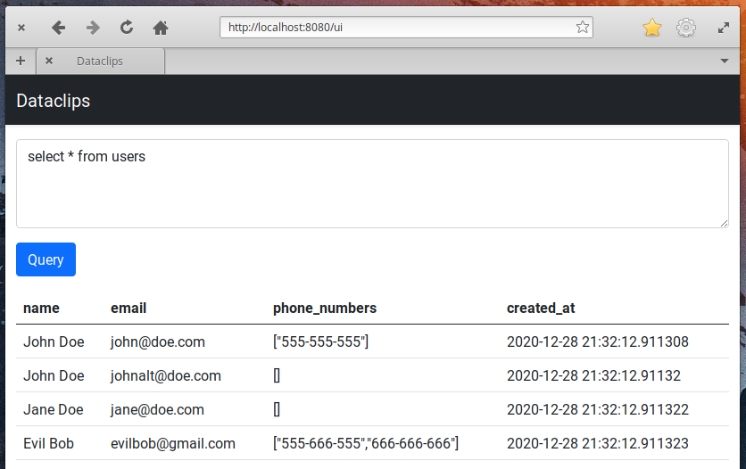

# Dataclips

A tiny, embeddable UI for exposing a SQL console from a Go application.

Heavily inspired by [Blazer](https://github.com/ankane/blazer) and [Heroku Dataclips](https://devcenter.heroku.com/articles/dataclips).

